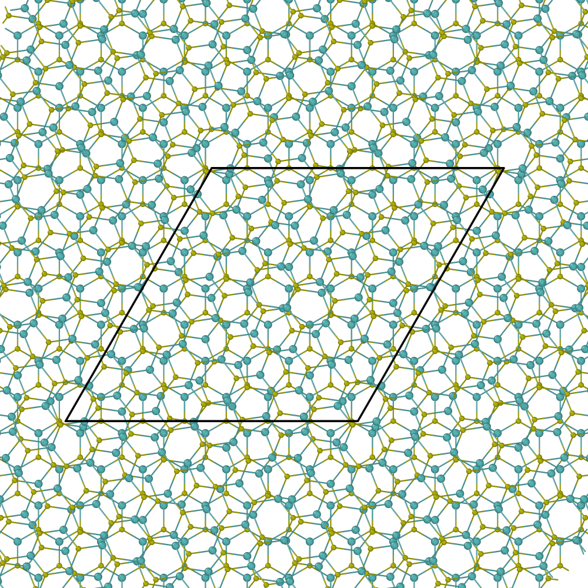
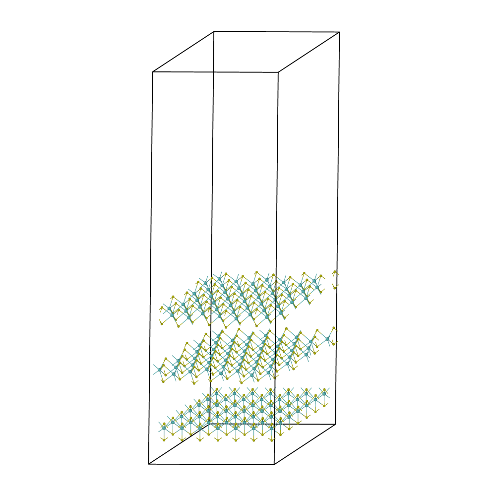
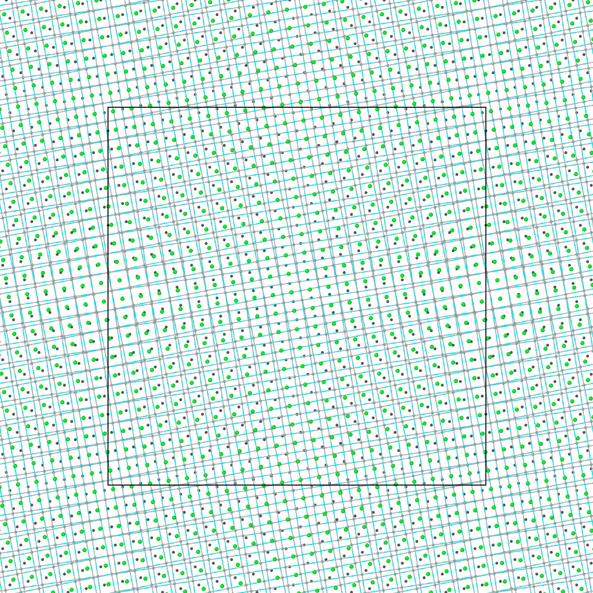
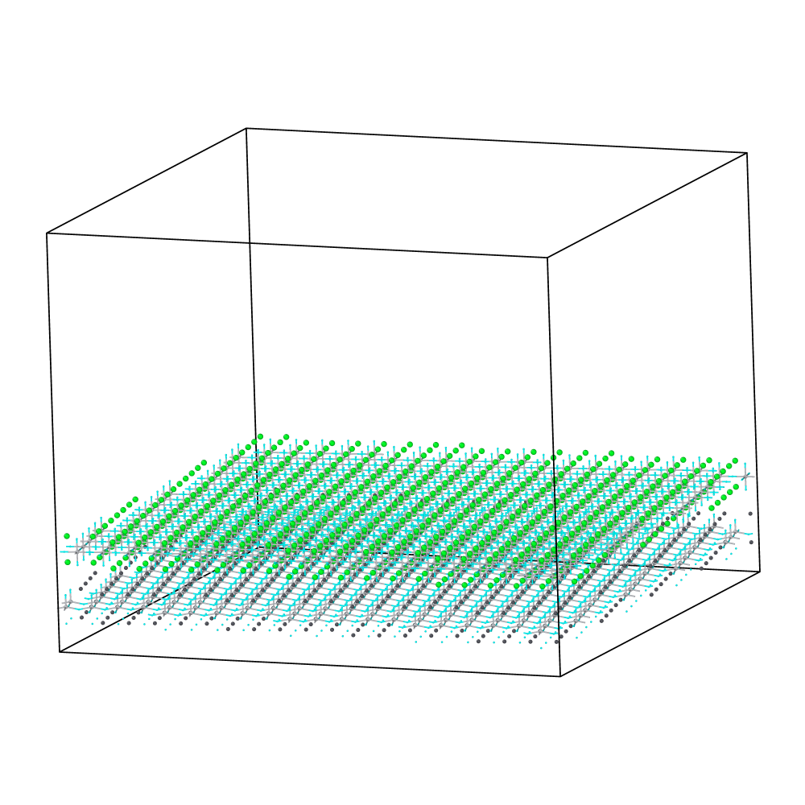

**MLM — Multi-Layer Moiré**  
**A Python package for building commensurate supercells of twisted multilayer 2D materials.**  
Twisting two (or more) atomically thin layers relative to each other produces *moiré* superlattices — the physical substrate for some of the most exciting phenomena in modern condensed-matter physics (flat bands, unconventional superconductivity, correlated insulators, ferroelectric polarization textures). Before those systems can be simulated with DFT or MD, one has to find a  *commensurate* supercell: a finite box in which the twisted pattern closes back on itself under periodic boundary conditions.  
MLM does that fast, for any Bravais lattice, and — unlike the existing bilayer-focused tools — for **three or more layers** with independent twist angles.  
*Capstone project, University of Southern California (Mork Family Department of Chemical Engineering and Materials Science). Manuscript in preparation* *.*  
  
**Why it's interesting**  
- **Algorithmic speedup.** The standard brute-force coincidence search is \mathcal{O}(N^4) in the search range N. MLM reformulates it as a *solve-and-round* problem: for each bottom-layer lattice vector \mathbf{v}, the matching top-layer indices \mathbf{m} are obtained by a single 2\times 2 linear solve B(\theta)\,\mathbf{m}=\mathbf{v}. That drops the scaling to \mathcal{O}(N^2) and gives 10²–10³× speedups at practical search ranges — enough that sub-1° twist angles (supercells with millions of atoms) become tractable on a single CPU core.  
- **Multilayer.** Existing tools (e.g. TWISTER) are bilayer-only. MLM chains the search: a trilayer stack is built by treating the bilayer moiré cell as the reference lattice for a second coincidence search against layer 3.  
- **Lattice-agnostic.** No hidden assumptions about hexagonal symmetry — works for graphene, TMDCs (MoS₂), perovskite oxides (SrTiO₃, PbTiO₃,BaTiO₃), and heterostructures (PTO+STO)with mismatched lattice constants.  
- **Scales to millions of atoms.** Atom selection uses fractional-coordinate folding + a two-pass deduplicator (integer binning + periodic KD-tree), avoiding the polygon-clipping tolerances that usually break at small twist angles.  
  
**Gallery**  
Structures generated by MLM and rendered in OVITO.  
**Trilayer MoS₂ — θ₁ = 21.79°, θ₂ = 38.21°**  

| Top view | Side view |
|:---:|:---:|
|  |  |

A three-layer twisted MoS₂ stack — the hierarchical moiré pattern emerges from two independent twist angles, something bilayer-only codes cannot produce.  

**Bilayer PbTiO₃ / SrTiO₃ heterostructure — 87°**  

| Top view | Side view |
|:---:|:---:|
|  |  |

A perovskite-oxide heterobilayer with mismatched lattice constants. MLM reports a per-structure residual δ_vec so the user can pick an acceptable approximate-commensurability tolerance for their simulation.  
  
**Install**  
git clone https://github.com/anikeya9/Multi-Layer-Moire-MLM-.git  
 cd Multi-Layer-Moire-MLM-  
 pip install -r requirements.txt  
 pip install -e .  
   
Requires Python ≥ 3.9. Core dependencies: NumPy, Polars, Numba, SciPy, ASE.  
  
**Getting started — worked examples in the notebooks**  
The best way to get started is to run the Jupyter notebooks in the `notebooks/` folder. Each one is self-contained and walks through a complete workflow step by step.  

| Notebook | What it does |  
|---|---|  
| `Bi-layer_structure_finder.ipynb` | Find all commensurate bilayer moiré angles for a given material and search range |  
| `Bi-layer-str-writer.ipynb` | Build the atomic structure for a chosen bilayer candidate and write VASP / LAMMPS files |  
| `trilayer_candidate_finder.ipynb` | Extend the bilayer result to a trilayer stack — find a third commensurate layer |  
| `trilayer_structure_creator.ipynb` | Build and export the full trilayer atomic structure |  

A detailed API tutorial will be added here after the accompanying manuscript is published.  
  
**Repository layout**  
src/MLM/                      # core package  
   match.py                    #   solve-and-round bilayer search  
   moire_lattice_vector_finder.py  # Numba + multiprocessing sweep  
   structure_writer.py         #   replication + fractional-coord atom selection  
 notebooks/                    # reproducible examples (bilayer / trilayer / benchmark)  
 moire_structures/             # pre-computed candidate supercells (pickles)  
 Manuscript/                   # CPC manuscript + figures  
   
  
**Applications**  
Structures produced by MLM have been used as inputs for:  
- DFT and MD studies of ferroelectric domain formation in twisted MoS₂ bilayers — *ACS Nano***20**, 4702 (2026).  
- Moiré polarization textures in perovskite oxide heterostructures — Sánchez-Santolino *et al.*,  *Nature***626**, 529 (2024); related *Phys. Rev. B***111**, 195420 work.  
  
**Skills demonstrated**  
Scientific Python (NumPy / SciPy / Polars), JIT compilation (Numba), parallelism (multiprocessing), computational geometry and change-of-basis linear algebra, algorithm design (complexity reduction from N^4 \to N^2), computational materials science (DFT / MD input generation, VASP & LAMMPS I/O via ASE), and technical writing for peer-reviewed publication.  
  
**Contact**  
**Anikeya Aditya** — [anikeya9@gmail.com  
   
 ](mailto:anikeya@usc.edu "mailto:anikeya@usc.edu")  
